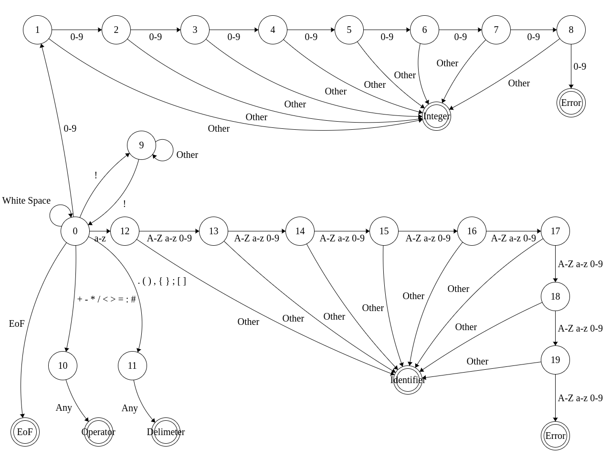

# Compiler

This is a simple compiler written for an undergraduate course in Program Translation.

## Usage

1. Run `make`.

2. Create a program file. For example, `myprogram.txt`:

```
! myprogram.txt !
program
var num
start
  let num = 42 ,
  print num ,
end
```

3. Compile the program into assembly code.

```
$ comp myprogram.txt
```

4. Run the interpreter on the corresponding assembly code

```
$ asmb myprogram.asm
```

## Sample Programs and Language Features

### Variables

```
program
var num
start
  let num = 42 ,
  print num ,
end
```

Output:

```
42
```


### Loops

```
program
var i
start
  let i = 0 ,
  iter (i < 3)
    start
      print i ,
      let i = (i + 1) ,
    end ,
  ,
end
```

Output:

```
0
1
2
```


### Conditionals

```
program
start
if (10 > 5)
  print 1 ,
,
end
```

Output:

```
1
```

#### Supported Operators

* **>** - Greater than
* **<** - Less than
* **:** - Equals


### Arithmetic and Expressions

```
program
start
  print #(((2 + 2) * 3) / 4) ,
end
```

Output:

```
-3
```

**NOTE:** All operators have standard meaning except **#** means *negation*.


### Input

```
program
start
  var num
  read num ,
  print num ,
end
```

The program would print whatever the user input.


### Comments

```
program
start
  ! This is a comment !
  print 1 ,
end
```

Comments are surrounded in exclamation points `!`.

## Frontend

The frontend of our compiler is composed of two parts:

1. Scanner - Converts a stream of characters into tokens
2. Parser - Converts the tokens into a parse tree

The scanner uses a driver and state transition table.

### Deterministic Finite Automaton


To edit import `assets/deterministic-finite-automaton.json` at https://merfoo.github.io/fsm/


### State Transition Table

The following table is located at `src/compiler/frontend/scanner/state_transition_table/state_transition_table.cpp`.

The function corresponding to the finite automaton driver is `Scanner::read()` in `src/compiler/frontend/scanner/scanner.cpp`.

To edit import `assets/state-transition-table.csv` into your favorite spreadsheet program.

| 0-9         | !            | + - * / < > = : # | . ( ) , { } ; [ ] | a-z         | A-Z         | EoF          | White Space  |
|-------------|--------------|-------------------|-------------------|-------------|-------------|--------------|--------------|
| 1           | 9            | 10                | 11                | 12          | Error       | EoF          | 0            |
| 3           | Integer      | Integer           | Integer           | Integer     | Integer     | Integer      | Integer      |
| 2           | Integer      | Integer           | Integer           | Integer     | Integer     | Integer      | Integer      |
| 4           | Integer      | Integer           | Integer           | Integer     | Integer     | Integer      | Integer      |
| 5           | Integer      | Integer           | Integer           | Integer     | Integer     | Integer      | Integer      |
| 6           | Integer      | Integer           | Integer           | Integer     | Integer     | Integer      | Integer      |
| 7           | Integer      | Integer           | Integer           | Integer     | Integer     | Integer      | Integer      |
| 8           | Integer      | Integer           | Integer           | Integer     | Integer     | Integer      | Integer      |
| Error       | Integer      | Integer           | Integer           | Integer     | Integer     | Integer      | Integer      |
| 9           | 0            | 9                 | 9                 | 9           | 9           | 9            | 9            |
| Operator    | Operator     | Operator          | Operator          | Operator    | Operator    | Operator     | Operator     |
| Delimiter   | Delimiter    | Delimiter         | Delimiter         | Delimiter   | Delimiter   | Delimiter    | Delimiter    |
| 13          | Identifier   | Identifier        | Identifier        | 13          | 13          | Identifier   | Identifier   |
| 14          | Identifier   | Identifier        | Identifier        | 14          | 14          | Identifier   | Identifier   |
| 15          | Identifier   | Identifier        | Identifier        | 15          | 15          | Identifier   | Identifier   |
| 16          | Identifier   | Identifier        | Identifier        | 16          | 16          | Identifier   | Identifier   |
| 17          | Identifier   | Identifier        | Identifier        | 17          | 17          | Identifier   | Identifier   |
| 18          | Identifier   | Identifier        | Identifier        | 18          | 18          | Identifier   | Identifier   |
| 19          | Identifier   | Identifier        | Identifier        | 19          | 19          | Identifier   | Identifier   |
| Error       | Identifier   | Identifier        | Identifier        | Error       | Error       | Identifier   | Identifier   |

### BNF

The parser enforces the following grammar rules.

\<S> -> **program** \<vars> \<block>

\<block> -> **start** \<vars> \<stats> **end**

\<vars> -> **var** **Identifier** \<vars> | **empty**

\<expr> -> \<H> **+** \<expr> | \<H> **-** \<expr> | \<H> **/** \<expr> | \<H> **\*** \<expr> | \<H>

\<H> -> **#** \<R> | \<R>

\<R> -> ( \<expr> ) | **Identifier** | **Integer**

\<stats> -> \<stat> \<m_stat>

\<m_stat> -> \<stats> | **empty**

\<stat> -> \<in> **,** | \<out> **,** | \<block> **,** | \<ifstat> **,** | \<loop> **,** | \<assign> **,**

\<in> -> **read** **Identifier**

\<out> -> **print** \<expr>

\<ifstat> -> **if** **(** \<expr> \<O> \<expr> **)** \<stat>

\<loop> -> **iter** **(** \<expr> \<O> \<expr> **)** \<stat>

\<assign> -> **let** **Identifier** **=** \<expr>

\<O> -> **<** | **>** | **:**

## Backend

The backend of our compiler is composed of three parts:

1. Static semantics
2. Code generation
3. and optimization

### Static Semantics

The only static semantics imposed by the compiler are proper use of variables. Before using a variable, you must first declare it using the **var** keyword.

In our language scopes are imposed by blocks denoted by **start** and **end**, conditionals denoted by **if**, and loops denoted by **iter**.

For our compiler, we implement **local scoping** in contrast to global scoping.

### Code Generation
We traverse the decorated parse tree for each node generate corresponding assembly code.

### Optimization
For optimization we remove redundant assembly code statements to read from stack memory when we just wrote to that same location in stack memory.

For example, consider the following program:

```
program
var id1
start
let id1 = 2 ,
print id1 ,
end
```

For which the compiler generates the following assembly code:

```
PUSH
PUSH
LOAD 2
STACKW 1
STACKR 1
STORE T0
WRITE T0
POP
POP
STOP
T0 0
```

The optimization removes the `STACKR 1` statement since it is immediately preceded by `STACKW 1`.
